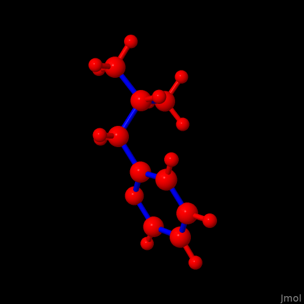

## background

DataWarrior provides an interactive 3D structure display. After a double
click (left mouse button) on the molecule of interest, the pull down
menu (right mouse button) offers to copy the current conformer as
`Molecule 3D` into a new instance of DataWarrior. It is an ASCII string,
e.g.

``` shell
eMHAIh@ #qxnjsbG[f@@CV?bpATlYqSQ^brHTcidvtKPTLXdhCNwimWYdBEohCvWAKGohzuBAvythT@H`@h@@
```

of two parts separated by an explicit single space. The first one likely
is about the molecule's 2D formula, similar to the one obtained by the
program's sketcher. The second retains the atoms' connectivity,
configuration of centers / axes of chirality, etc. in a condensed
representation; in contrast to SMILES strings, this format additionally
retains the atom's coordinates as an `idcode`. Though public,[^1]
openbabel apparently does not provide (yet) a conversion from this
format into an other as e.g., `.sdf` for additional work eventually
outside DW,[^2] e.g. `.sdf` for additional work eventually outside DW.

This script wants to close this gap. Implemented in Python, an
instruction in pattern of

``` shell
python3 ./datawarrior_conformer_export.py 'eMHAIh@ #qxnjsbG[f@@CV?bpATlYqSQ^brHTcidvtKPTLXdhCNwimWYdBEohCvWAKGohzuBAvythT@H`@h@@'
```

writes a new file `container.dwar`. From there, it is possible to export
the structure in other data formats as usual, e.g. `File` -\>
`Save Special` -\> `SD File` with the option `Atom coordinates` on level
`3D Structure`. The script's action does not depend on additional
resources.

## cross check

To read a `.sdf` of a 3D molecular structure with DataWarrior and to
export again as a 3d `.sdf` will not necessarily retain the original
coordinates. A plausible reason for this could be if programs to prepare
the original `.sdf` and DataWarrior elect a different position of a
reference point of the coordinate system vs the structure described
(e.g., at the geometric centre of the molecule, at a corner of the scene
depicted). Some programs write (preferentially) `.sdf` in the v2000,
others in the v3000 syntax. This is why a simple `diff -s` to compare
the initial file with the description recovered from the `idcode` is not
sensible.

Instead, two structures can be compared by alignment and superposition.
The Kabsch test[^3] is an example where the goodness of fit can be
quantified by the remaining difference between two conformers.

### pure numeric check

Jimmy Kromann initiated with [rmsd](https://github.com/charnley/rmsd) an
implementation of the Kabsch test in Python.[^4] As a check, a model
about an alkylated pyridine was generated by openbabel

``` shell
obabel -:"c1cccnc1CC(C)C" -h --gen3d -O pyridine.sdf
```

DataWarrior read this file, the string harvested from the 3D structure
widget is

    deV@@@rQQIFTpDEP@@ #q_ng_yKUxUzOQCrW~`umYF^lxOHrJPLVa]Wn\^VwDUALTK{{AN`l@@CWQPfm|Ok}_mlQBdOaAiqYMpqssQoG|WOlLzdIgwhOdVCrXXV{KSVvOVsvaRiNnJRRlF?tM[lnT]bKA_oz[bDN^JvbabKtNyO_~RxIa@UOk[~ttIF?~K_qr?o^TqriP@\@AL@@

By

``` shell
python3 ./datawarrior_conformer_export.py 'deV@@@rQQIFTpDEP@@ #q_ng_yKUxUzOQCrW~`umYF^lxOHrJPLVa]Wn\^VwDUALTK{{AN`l@@CWQPfm|Ok}_mlQBdOaAiqYMpqssQoG|WOlLzdIgwhOdVCrXXV{KSVvOVsvaRiNnJRRlF?tM[lnT]bKA_oz[bDN^JvbabKtNyO_~RxIa@UOk[~ttIF?~K_qr?o^TqriP@\@AL@@'
```

the new file `container.dwar` was written, its structure was exported as
a 3D .sdf (v3000) with DataWarrior as `container.sdf`.

To perform the Kabsch test with Kroman's `rmsd`, both files were
converted into the `.xyz` format, then submitted:

``` shell
$ obabel pyridine.sdf container.sdf -oxyz -m
$ python ./calculate_rmsd.py --version
rmsd 1.5.1

See https://github.com/charnley/rmsd for citation information
$ python ./calculate_rmsd.py pyridine.xyz container.xyz --reorder --ignore-hydrogen
0.00018934229951753166
```

The very small residual error between two structures strongly suggests
the matching conformer was exported.

### both visual check

Kroman's implementation equally allows the export of the aligned
structure using the coordinate system of the reference structure. Since
Jmol allows the simultaneous display of two model structures, the visual
inspection complements the numeric analysis.

Input to the Kabsch test *excluding* hydrogen atoms:

``` shell
obabel pyridine.sdf container.sdf -oxyz -d -m
calculate_rmsd pyridine.xyz container.xyz --reorder --print > aligned.xyz
```

Commands issued to Jmol's console (version 16.1.11 by 2023-04-19):

``` javascript
load files "pyridine.xyz" "aligned.xyz";
model 0;
select model=1.1;
color red;
select model=2.1;
color blue;
write "superposition.png";
```



Congruent with the small RSMD calculated earlier, the superposition of
the two models does no exhibit a significant protrusion which would be
indicative of one being only partially represent the other model.

# Footnotes

[^1]: `idcodes` are used to encode molecular structures e.g., by the
    `openchemlib` project. See <https://github.com/Actelion/openchemlib>

[^2]: As a feature suggestion, a ticket was filed on the OpenBabel
    project on \<2020-12-10 Thu\>
    (<https://github.com/openbabel/openbabel/issues/2311>).

[^3]: Kabsch, W. A Solution for the Best Rotation to Relate Two Sets of
    Vectors. *Acta Cryst A* **1976**, *32*, 922–923.
    <https://doi.org/10.1107/S0567739476001873>. For a recapitulation,
    see e.g. <https://en.wikipedia.org/wiki/Kabsch_algorithm>.

[^4]: For the the project, see <https://github.com/charnley/rmsd>
